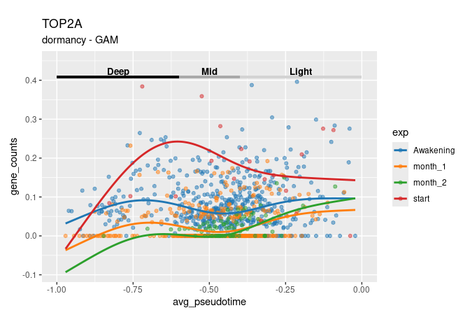
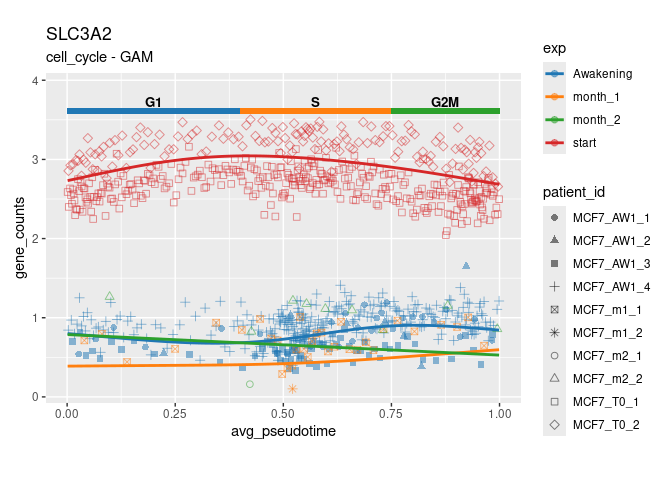
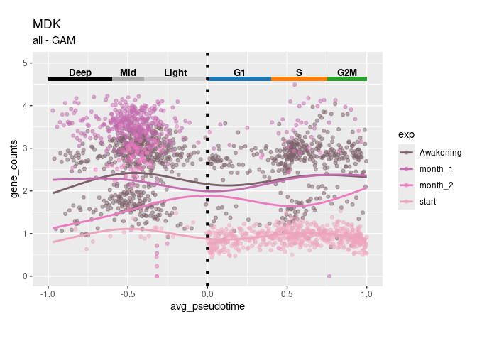
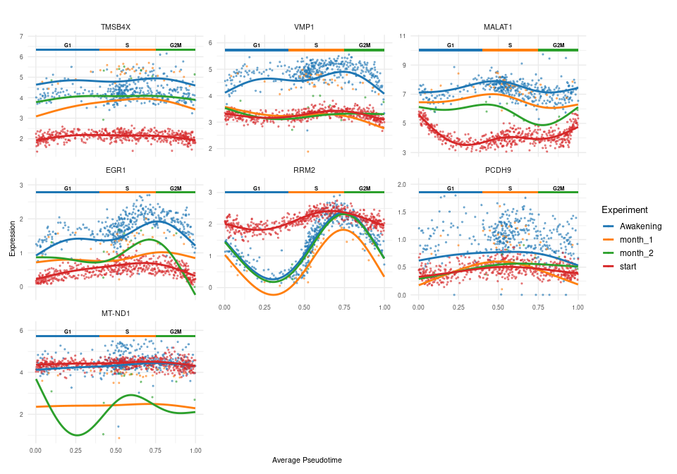
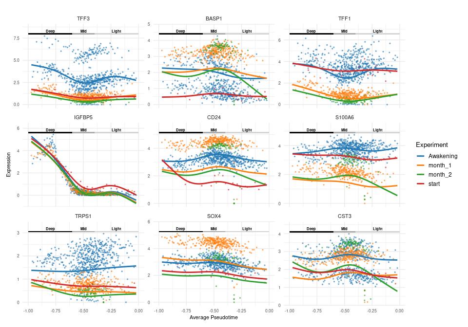
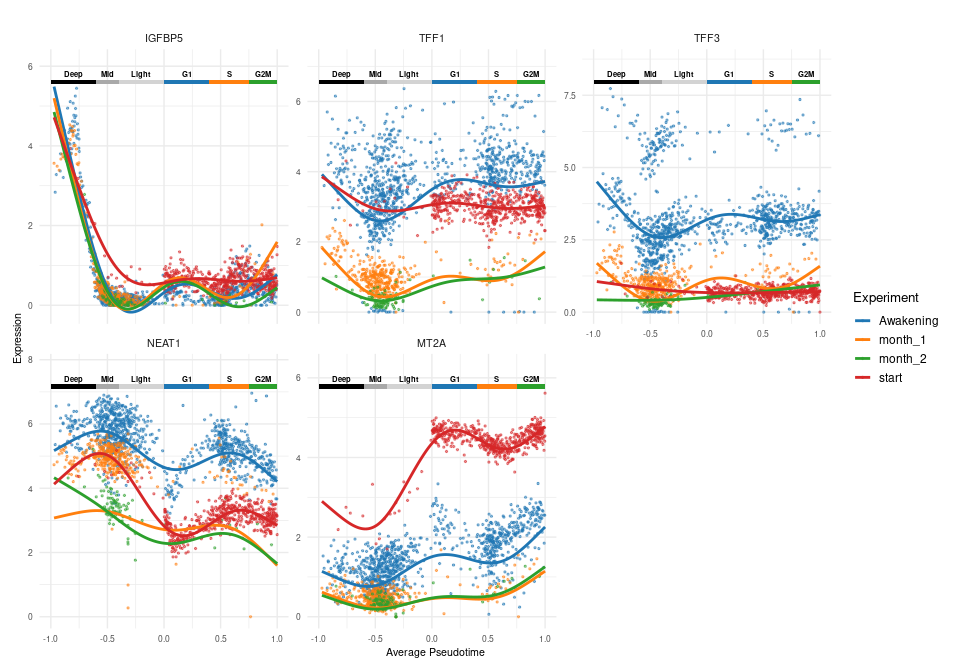

OuriGAMi
================

This Rmd runs OuriGAMi, a tool which uses a generalized additive model
to identify genes that are correlated with dormancy pseudotime and cell
cycle pseudotime. OuriGAMi requires path to adata, ouroborous pseudotime
result, and metadata file (file with cell_id to condition).

``` r
adata_path <- '/projects/steiflab/scratch/glchang/livBC/downsample/rosano.h5ad'
obo_path <- '/projects/steiflab/scratch/glchang/data/Rosano_BC/ouroboros_embeddings_pseudotimes.csv'

# Can be NA if no experimental condition to contrast
meta_path <- '/projects/steiflab/scratch/glchang/livBC/downsample/rosano_meta.csv'
```

### Installation

OuriGAMi requires the following R packages:

``` r
if (!requireNamespace("BiocManager", quietly = TRUE)) 
  install.packages("BiocManager") 

install.packages(c("mgcv","furrr","future","dplyr","readr","progressr","ggplot2","purrr","reticulate", "patchwork"))
BiocManager::install(c("scran","scuttle","zellkonverter"))
```

#### Set up enrivoment and import data

This pipeline depends on:

1.  The R helper script: OuriGAMi_utils.R (use absolute path if util
    file is not found)
2.  ouroboros_env python path (used via reticulate)

To find the correct Python path, run in terminal and copy output to
PYTHOHN_ENV: readlink -f \$(which python)

``` r
PYTHON_ENV <- "/home/glchang/miniconda3/envs/ouroboros_env/bin/python3.6"

Sys.setenv(RETICULATE_PYTHON = PYTHON_ENV)

# Run .rs.restartR() if you get an error below and rerun whole script
suppressPackageStartupMessages({
  library(mgcv)
  library(zellkonverter)
  library(furrr)
  library(future)
  library(dplyr)
  library(readr)
  library(progressr)
  library(ggplot2)
  library(purrr)
  library(reticulate)
  library(scuttle)
  library(scran)
  library(patchwork)
})

# If this fails, replace with full path to the file
source("OuriGAMi_utils.R")
```

This will read in the adata and convert it to SingleCellExperiment
object. The metadata will also be imported, make sure to select the
correct column name for your cell id and experimental group.

``` r
# Can alternative read in file using matrix.mtx, obs.csv, var.csv and build SingleCellExperiment object manually
sce <- read_adata(adata_path)
  
# Expect 2-3 columns: "cell" (cell_id), "exp" (experimental condition) and optionally "patient_id" to use it as co-variate
# Can also be retrieved using colData(sce) if stored in SingleCellExperiment
# Set meta as NA if you aren't comparing between conditions
meta <- read_delim(meta_path, show_col_types = FALSE) %>%
  `colnames<-`(c("cell", 'exp', 'patient_id'))

head(meta)
```

    ## # A tibble: 6 × 3
    ##   cell                        exp       patient_id
    ##   <chr>                       <chr>     <chr>     
    ## 1 AAACCCACAGGAATCG_MCF7_AW1_1 Awakening MCF7_AW1_1
    ## 2 AAACCCAGTTTACGAC_MCF7_AW1_1 Awakening MCF7_AW1_1
    ## 3 AAACCCATCCGTCCTA_MCF7_AW1_1 Awakening MCF7_AW1_1
    ## 4 AAACCCATCCTCTGCA_MCF7_AW1_1 Awakening MCF7_AW1_1
    ## 5 AAACGAACAAGATCCT_MCF7_AW1_1 Awakening MCF7_AW1_1
    ## 6 AAACGAACACACTTAG_MCF7_AW1_1 Awakening MCF7_AW1_1

Next filter sce to remove genes with low expression. Optionally, sce can
be further filtered to run OurGAMi on HVG only and/or specific genes of
interest. Afterwards, read in metadata and ouroboros data.

``` r
assay_type = 'X' # Layer for raw counts in SingleCellExperiment object
min_prop_cell= 0.05 # Filter for proportion of cells expressing gene

n_hvg = 100 # Number of HVG, NA to not filter by HVG
genes = NA

# Filter low expression genes
if (!all(is.na(min_prop_cell)) & min_prop_cell != 0){
  keep <- rowSums(assay(sce, assay_type) > 0) / ncol(sce) >= min_prop_cell
  sce <- sce[keep, ]
}

# Filter for genes of interest
if (all(is.na(genes))) {
    genes <- rownames(sce)
} else {
    genes <- intersect(genes, rownames(sce))
}

sce <- sce[, colSums(assay(sce, assay_type)) > 0]
sce <- logNormCounts(sce, assay.type=assay_type)

# Filter for HVG
if (!all(is.na(n_hvg)) & n_hvg != 0){
  gene_var <- modelGeneVar(sce, assay.type = "logcounts")
  hvgs <- getTopHVGs(gene_var, n = n_hvg, var.threshold = -Inf)
  genes <- intersect(hvgs, genes)
}

files <- read_files(sce, meta, obo_path, genes)
```

    ## New names:
    ## • `` -> `...1`

## Get gene score (optional)

Rather than running GAM model gene expression vs pseudotime, we can run
gene set score vs pseudotime. This will require named list where name is
gene set name and vector is gene name. Set HVG = 0 and n_hvg = 0

``` r
signature <- read_delim('hallmark_genes.csv', show_col_types = FALSE)
gene_sets <- split(signature$gene_name, signature$pathway)

gene_set_mat <- get_gene_set(files, gene_sets)

files$expr_mat <- gene_set_mat$score_mat
files$genes <- gene_set_mat$gene_sets
```

## GAM paramters

GAM parameters can be specified below. The main parameter is k which
controls the smoothness or waviness of the model. The family function
should be set to gaussian() for log normalized or gene scores and nb()
(negative binomial) should be used for raw counts.

``` r
threads=23
BIN_SIZE <- 30

reference_exp <- 'start' # Reference condition (Must be one of the condition in meta; NA if meta doesn't exist)

k=5                                  # GAM model parameter that controls smoothness/waviness of model
family_function <- gaussian()        # use nb() if raw counts
```

## Dormancy Depth

This runs GAM model for every genes in files\$genes vs dormancy
pseudotime. This will take a while to run, decrease number of genes or
increase threads to speed up.

``` r
type <- 'dormancy'
binned_files_dorm <- bin_files(files, type, BIN_SIZE)
dormancy_metric <- run_GAM(binned_files_dorm, type, files$genes, threads=threads, k=k, family_function=family_function, ref_exp=reference_exp, cyclic_cubic=F)
dormancy_metric 
```

    ## # A tibble: 100 × 30
    ##    gene   pseudotime    R2 deviance   main_p main_edf main_peak main_peak_region
    ##    <chr>  <chr>      <dbl>    <dbl>    <dbl>    <dbl>     <dbl> <chr>           
    ##  1 MALAT1 dormancy   0.669    0.675  3.36e-2     2.88   -0.972  deep_dorm       
    ##  2 TFF1   dormancy   0.927    0.929  0           3.42   -0.972  deep_dorm       
    ##  3 TFF3   dormancy   0.948    0.949  5.77e-3     3.24   -0.972  deep_dorm       
    ##  4 NEAT1  dormancy   0.842    0.845  0           2.80   -0.972  deep_dorm       
    ##  5 MT2A   dormancy   0.827    0.831  1.03e-2     2.93   -0.972  deep_dorm       
    ##  6 TMSB4X dormancy   0.872    0.874  0           3.85   -0.446  mid_dorm        
    ##  7 TUBA1B dormancy   0.695    0.700  2.81e-7     1.00   -0.0216 light_dorm      
    ##  8 SPTSSB dormancy   0.803    0.806  9.61e-2     1.00   -0.972  deep_dorm       
    ##  9 BASP1  dormancy   0.944    0.945  5.19e-3     3.08   -0.972  deep_dorm       
    ## 10 CD24   dormancy   0.905    0.907  0           3.90   -0.972  deep_dorm       
    ## # ℹ 90 more rows
    ## # ℹ 22 more variables: Awakening_p <dbl>, Awakening_edf <dbl>,
    ## #   Awakening_contrast_p <dbl>, Awakening_peak <dbl>,
    ## #   Awakening_peak_region <chr>, month_1_p <dbl>, month_1_edf <dbl>,
    ## #   month_1_contrast_p <dbl>, month_1_peak <dbl>, month_1_peak_region <chr>,
    ## #   month_2_p <dbl>, month_2_edf <dbl>, month_2_contrast_p <dbl>,
    ## #   month_2_peak <dbl>, month_2_peak_region <chr>, start_p <dbl>, …

## Cell Cycle Pseudotime

This runs GAM model for every genes in files\$genes vs cell cycle and
dormancy pseudotime. cyclic_cubic can be set to TRUE to have model wrap
around (G1 starts where G2M ends).

``` r
type <- 'cell_cycle'
binned_files_cc <- bin_files(files, type, BIN_SIZE)
cc_metric <- run_GAM(binned_files_cc, type, files$genes, threads=threads, k=k, family_function=family_function, ref_exp=reference_exp, cyclic_cubic=F)
cc_metric
```

    ## # A tibble: 100 × 30
    ##    gene   pseudotime    R2 deviance   main_p main_edf main_peak main_peak_region
    ##    <chr>  <chr>      <dbl>    <dbl>    <dbl>    <dbl>     <dbl> <chr>           
    ##  1 MALAT1 cell_cycle 0.943    0.945  0           3.92   0.462   S               
    ##  2 TFF1   cell_cycle 0.852    0.855  2.17e-3     2.82   0.00116 G1              
    ##  3 TFF3   cell_cycle 0.963    0.964  2.35e-1     1.00   0.00116 G1              
    ##  4 NEAT1  cell_cycle 0.922    0.924  1.09e-6     3.52   0.999   G2M             
    ##  5 MT2A   cell_cycle 0.976    0.976  0           3.90   0.00116 G1              
    ##  6 TMSB4X cell_cycle 0.964    0.965  0           3.68   0.693   S               
    ##  7 TUBA1B cell_cycle 0.954    0.955  1.29e-4     2.63   0.00116 G1              
    ##  8 SPTSSB cell_cycle 0.950    0.951  0           3.98   0.00116 G1              
    ##  9 BASP1  cell_cycle 0.914    0.916  1.78e-1     1.00   0.00116 G1              
    ## 10 CD24   cell_cycle 0.950    0.951  9.53e-5     3.31   0.999   G2M             
    ## # ℹ 90 more rows
    ## # ℹ 22 more variables: Awakening_p <dbl>, Awakening_edf <dbl>,
    ## #   Awakening_contrast_p <dbl>, Awakening_peak <dbl>,
    ## #   Awakening_peak_region <chr>, month_1_p <dbl>, month_1_edf <dbl>,
    ## #   month_1_contrast_p <dbl>, month_1_peak <dbl>, month_1_peak_region <chr>,
    ## #   month_2_p <dbl>, month_2_edf <dbl>, month_2_contrast_p <dbl>,
    ## #   month_2_peak <dbl>, month_2_peak_region <chr>, start_p <dbl>, …

## Both dormancy and cell cycle pseudotime combined

This runs GAM model for every genes in files\$genes vs pseudotime
(combined cell cycle and dormancy).

``` r
type <- 'all'
binned_files_all <- bin_files(files, type, BIN_SIZE)
all_metric <- run_GAM(binned_files_all, type, files$genes, threads=threads, k=k, family_function=family_function, ref_exp=reference_exp, cyclic_cubic=F)
all_metric
```

    ## # A tibble: 100 × 30
    ##    gene   pseudotime    R2 deviance   main_p main_edf main_peak main_peak_region
    ##    <chr>  <chr>      <dbl>    <dbl>    <dbl>    <dbl>     <dbl> <chr>           
    ##  1 MALAT1 all        0.910    0.911 0.00252      1.00    -0.972 deep_dorm       
    ##  2 TFF1   all        0.907    0.908 0.000254     3.80    -0.972 deep_dorm       
    ##  3 TFF3   all        0.945    0.945 0.315        2.28    -0.972 deep_dorm       
    ##  4 NEAT1  all        0.898    0.900 0            3.89     0.653 S               
    ##  5 MT2A   all        0.976    0.976 0            3.86     1.000 G2M             
    ##  6 TMSB4X all        0.959    0.959 0            3.96    -0.496 mid_dorm        
    ##  7 TUBA1B all        0.947    0.947 0            3.89    -0.972 deep_dorm       
    ##  8 SPTSSB all        0.893    0.894 0.0112       2.13     1.000 G2M             
    ##  9 BASP1  all        0.955    0.955 0.000176     1.00    -0.972 deep_dorm       
    ## 10 CD24   all        0.950    0.950 0.0358       1.00    -0.972 deep_dorm       
    ## # ℹ 90 more rows
    ## # ℹ 22 more variables: Awakening_p <dbl>, Awakening_edf <dbl>,
    ## #   Awakening_contrast_p <dbl>, Awakening_peak <dbl>,
    ## #   Awakening_peak_region <chr>, month_1_p <dbl>, month_1_edf <dbl>,
    ## #   month_1_contrast_p <dbl>, month_1_peak <dbl>, month_1_peak_region <chr>,
    ## #   month_2_p <dbl>, month_2_edf <dbl>, month_2_contrast_p <dbl>,
    ## #   month_2_peak <dbl>, month_2_peak_region <chr>, start_p <dbl>, …

## GAM output

Both dormancy_metric and cc_metric outputs statistics of GAM models.
Model Fit Quality

- **R2:** Variance in gene counts explained by the model
- **deviance:** Proportion of deviance explained by the model

Pseudotime Main Effect (All cells aggregated)

- **main_p:** Tests whether gene expression changes significantly along
  pseudotime for all cells
- **main_edf:** Complexity of curve for of all cells

Per-Experiment Metrics

- \*\*`{exp}`\_p:\*\* Significance of `{exp}` curve shape differing from
  all other cells
- \*\*`{exp}`\_edf:\*\* Complexity of `{exp}` curve
- \*\*`{exp}`\_contrast:\*\* Different baseline level compared to
  reference_exp
- \*\*`{exp}`\_peak:\*\* Region of pseudotime where `{exp}` curve peaked

Patient Covariate (optional)

- **patient_p:** Tests whether expression differs significantly across
  patients (vertical shift)
- **patient_edf:** Magnitude of expression variability across patients
  (0 = patients don’t differ, higher = greater between-patient
  differences)

## Plot GAM for individual gene

### `plot_gene()`

Plots gene expression against pseudotime, with a fitted GAM trend line
and phase-region annotations along the top of the plot.

**Parameters**

- **`gene`** — Name of the gene to plot.

- **`binned_files`** — Generated above using bin_files. Named
  `binned_files_dorm`, `binned_files_cc`, `binned_files_all` in this
  file

- **`model`** — Plot GAM or LM model (options: gam, lm)

- **`patient_shape`** — Use different shape for different patient_id
  (default FALSE); only applicable if patient_id is provided in the meta
  file.”

- **`palette`** — Named character vector of hex colors, or `NA` (default
  palette).

- **`point_alpha`** — Numeric, transparency of observed points (default
  `0.5`).

- **`point_size`** — Numeric, size of observed points (default `1.5`).

**Returns:** a `ggplot` object.

``` r
gene_of_interest <- 'TOP2A'
plot_gene(gene_of_interest, binned_files_dorm, model='gam')
```

<!-- -->

Can colour points based on patient_id if provided in meta.

``` r
gene_of_interest <- 'SLC3A2'
plot_gene(gene_of_interest, binned_files_cc, model='gam', patient_shape = T, point_size=2)
```

<!-- -->

Colour palette can be provided to plot_gene function.

``` r
gene_of_interest <- 'MDK'
plot_gene(gene_of_interest, binned_files_all, model='gam',palette = c('Awakening'='#7C606B', 'month_1'='#C46BAE', 'month_2'='#EB7BC0', 'start'='#EDA4BD' ))
```

<!-- -->

## Plot top genes

## `plot_multi_genes()`

Plots expression against pseudotime for multiple genes at once, faceted
one panel per gene, each with a fitted GAM trend line and phase-region
annotations along the top.

**Parameters**

- **`gene`** — Name of the gene to plot.

- **`binned_files`** — Generated above using bin_files. Named
  `binned_files_dorm`, `binned_files_cc`, `binned_files_all` in this
  file

- **`model`** — Plot GAM or LM model (options: gam, lm)

- **`patient_shape`** — Use different shape for different patient_id
  (default FALSE); only applicable if patient_id is provided in the meta
  file.”

- **`palette`** — Named character vector of hex colors, or `NA` (default
  palette). If colour_by_patient = TRUE, must include names for both
  exp.

- **`point_alpha`** — Numeric, transparency of observed points (default
  `0.5`).

- **`point_size`** — Numeric, size of observed points (default `1.5`).

**Returns:** a `ggplot` object

The cc_metric and dormancy_metric can be filtered and arrange to find
genes of interest. The genes can be filtered based on p-value, edf, peak
region. The top genes can be plotted using `plot_multi_genes` function.

``` r
top_genes <- cc_metric %>%
  dplyr::filter(main_p < 0.05) %>%
  dplyr::filter(main_peak_region == 'S') %>%
  arrange(desc(R2)) %>%
  dplyr::slice(1:12) %>%
  pull(gene)

plot_multi_genes(top_genes, binned_files_cc, 'cell_cycle', model='gam', legend=T, point_size=0.5)
```

    ## Ignoring unknown labels:
    ## • shape : "Patient"

<!-- -->

You can filter based on specific condition (e.g Awakening_p \< 0.05),
peak regions of each condition (e.g Awakening_peak_region ==
‘deep_dorm’) to find genes of interest in specific condition and region.

``` r
top_genes <- dormancy_metric %>%
  dplyr::filter(main_peak_region == 'deep_dorm') %>%
  dplyr::filter(main_p < 0.05) %>%
  arrange(desc(R2)) %>%
  dplyr::slice(1:9) %>%
  pull(gene)

plot_multi_genes(top_genes, binned_files_dorm, 'dormancy', model='gam', legend=T, point_size=0.5)
```

    ## Ignoring unknown labels:
    ## • shape : "Patient"

<!-- -->

Alternatively, a list of genes of interest can be used as input for
plot_multi_genes.

``` r
gene_lst <- c("IGFBP5", "TFF1", "TFF3", "NEAT1", "MT2A")
#gene_lst <- c('H1-1', 'H1-3', 'H1-4', 'H1-5', 'H2AC20', 'H2BC11', 'H4C8', 'IRAG1')

plot_multi_genes(gene_lst, binned_files_all, 'all', model='gam', legend=T, point_size=0.5)
```

    ## Ignoring unknown labels:
    ## • shape : "Patient"

<!-- -->
