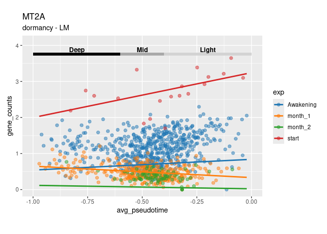
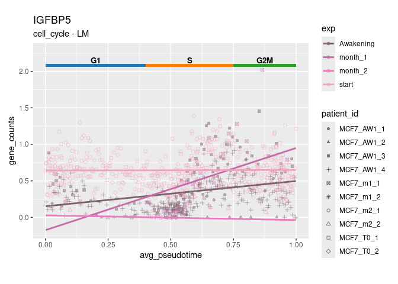
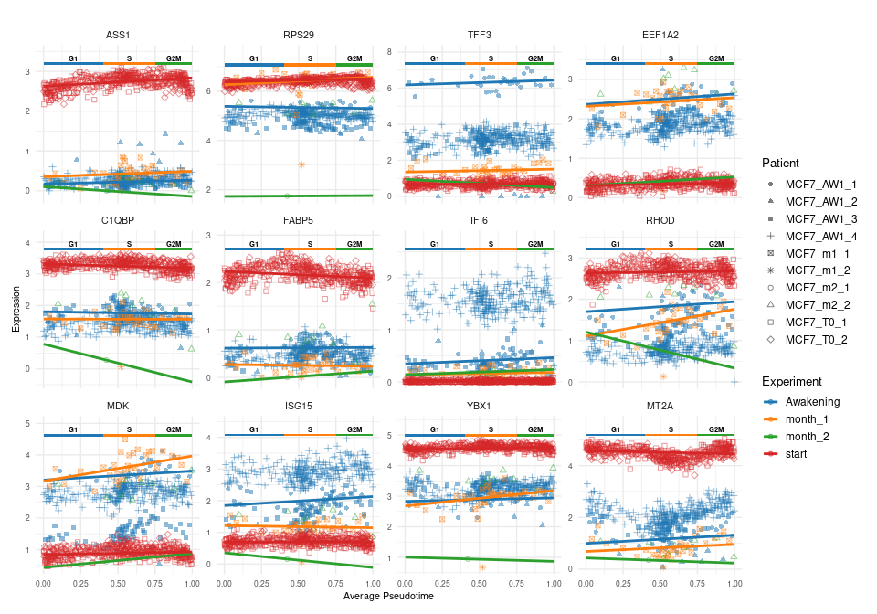
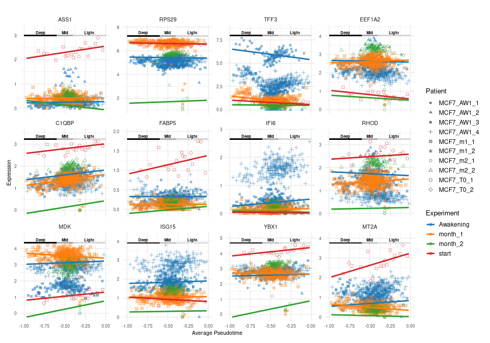

OuriGAMi_LM
================

This Rmd runs OuriGAMi, a tool which uses a generalized additive model
to identify genes that are correlated with dormancy pseudotime and cell
cycle pseudotime. OuriGAMi requires path to adata, ouroborous pseudotime
result, and metadata file (file with cell_id to condition).

``` r
adata_path <- '/projects/steiflab/scratch/glchang/livBC/downsample/rosano.h5ad'
obo_path <- '/projects/steiflab/scratch/glchang/data/Rosano_BC/ouroboros_embeddings_pseudotimes.csv'

# Can be NA if no experimental condition to contrast
meta_path <- '/projects/steiflab/scratch/glchang/livBC/downsample/rosano_meta.csv'
```

### Installation

OuriGAMi requires the following R packages:

``` r
if (!requireNamespace("BiocManager", quietly = TRUE)) 
  install.packages("BiocManager") 

install.packages(c("mgcv","furrr","future","dplyr","readr","progressr","ggplot2","purrr","reticulate", "patchwork"))
BiocManager::install(c("scran","scuttle","zellkonverter"))
```

#### Set up enrivoment and import data

This pipeline depends on:

1.  The R helper script: OuriGAMi_utils.R (use absolute path if util
    file is not found)
2.  ouroboros_env python path (used via reticulate)

To find the correct Python path, run in terminal and copy output to
PYTHOHN_ENV: readlink -f \$(which python)

``` r
PYTHON_ENV <- "/home/glchang/miniconda3/envs/ouroboros_env/bin/python3.6"

Sys.setenv(RETICULATE_PYTHON = PYTHON_ENV)

# Run .rs.restartR() if you get an error below and rerun whole script
suppressPackageStartupMessages({
  library(mgcv)
  library(zellkonverter)
  library(furrr)
  library(future)
  library(dplyr)
  library(readr)
  library(progressr)
  library(ggplot2)
  library(purrr)
  library(reticulate)
  library(scuttle)
  library(scran)
  library(patchwork)
})

# If this fails, replace with full path to the file
source("OuriGAMi_utils.R")
```

This will read in the adata and convert it to SingleCellExperiment
object. The metadata will also be imported, make sure to select the
correct column name for your cell id and experimental group.

``` r
# Can alternative read in file using matrix.mtx, obs.csv, var.csv and build SingleCellExperiment object manually
sce <- read_adata(adata_path)


# Expect 2-3 columns: "cell" (cell_id), "exp" (experimental condition) and optionally "patient_id" to use it as co-variate
# Can also be retrieved using colData(sce) if stored in SingleCellExperiment
# Set meta as NA if you aren't comparing between conditions
meta <- read_delim(meta_path, show_col_types = FALSE) %>%
  `colnames<-`(c("cell", 'exp', 'patient_id'))

head(meta)
```

    ## # A tibble: 6 × 3
    ##   cell                        exp       patient_id
    ##   <chr>                       <chr>     <chr>     
    ## 1 AAACCCACAGGAATCG_MCF7_AW1_1 Awakening MCF7_AW1_1
    ## 2 AAACCCAGTTTACGAC_MCF7_AW1_1 Awakening MCF7_AW1_1
    ## 3 AAACCCATCCGTCCTA_MCF7_AW1_1 Awakening MCF7_AW1_1
    ## 4 AAACCCATCCTCTGCA_MCF7_AW1_1 Awakening MCF7_AW1_1
    ## 5 AAACGAACAAGATCCT_MCF7_AW1_1 Awakening MCF7_AW1_1
    ## 6 AAACGAACACACTTAG_MCF7_AW1_1 Awakening MCF7_AW1_1

Next filter sce to remove genes with low expression. Optionally, sce can
be further filtered to run OurGAMi on HVG only and/or specific genes of
interest. Afterwards, read in metadata and ouroboros data.

``` r
assay_type = 'X' # Layer for raw counts in SingleCellExperiment object
min_prop_cell= 0.05 # Filter for proportion of cells expressing gene

n_hvg = 150 # Number of HVG, NA to not filter by HVG
genes = NA

# Filter low expression genes
if (!all(is.na(min_prop_cell)) & min_prop_cell != 0){
  keep <- rowSums(assay(sce, assay_type) > 0) / ncol(sce) >= min_prop_cell
  sce <- sce[keep, ]
}

# Filter for genes of interest
if (all(is.na(genes))) {
    genes <- rownames(sce)
} else {
    genes <- intersect(genes, rownames(sce))
}

sce <- sce[, colSums(assay(sce, assay_type)) > 0]
sce <- logNormCounts(sce, assay.type=assay_type)

# Filter for HVG
if (!all(is.na(n_hvg)) & n_hvg != 0){
  gene_var <- modelGeneVar(sce, assay.type = "logcounts")
  hvgs <- getTopHVGs(gene_var, n = n_hvg, var.threshold = -Inf)
  genes <- intersect(hvgs, genes)
}

files <- read_files(sce, meta, obo_path, genes)
```

    ## New names:
    ## • `` -> `...1`

## Get gene score (optional)

Rather than running GAM model gene expression vs pseudotime, we can run
gene set score vs pseudotime. This will require named list where name is
gene set name and vector is gene name. Set HVG = 0 and n_hvg = 0

``` r
signature <- read_delim('signatures.csv', show_col_types = FALSE)
gene_sets <- split(signature$gene_symbol, signature$geneSet_id)

gene_set_mat <- get_gene_set(files, gene_sets)

files$expr_mat <- gene_set_mat$score_mat
files$genes <- gene_set_mat$gene_sets
```

## GAM paramters

GAM parameters can be specified below. The main parameter is k which
controls the smoothness or waviness of the model. The family function
should be set to gaussian() for log normalized or gene scores and nb()
(negative binomial) should be used for raw counts.

``` r
threads=23
BIN_SIZE <- 30

reference_exp <- 'start' # Reference condition (Must be one of the condition in meta; NA if meta doesn't exist)
```

## Dormancy Depth

This runs GAM model for every genes in files\$genes vs dormancy
pseudotime. This will take a while to run, decrease number of genes or
increase threads to speed up.

``` r
type <- 'dormancy'
binned_files_dorm <- bin_files(files, type, BIN_SIZE)
dormancy_metric <- run_LM(binned_files_dorm, type, files$genes, threads=threads, ref_exp=reference_exp)
dormancy_metric
```

    ## # A tibble: 150 × 14
    ##    gene   pseudotime    R2   main_p main_slope start_slope     start_p
    ##    <chr>  <chr>      <dbl>    <dbl>      <dbl>       <dbl>       <dbl>
    ##  1 MALAT1 dormancy   0.665 5.11e- 1     0.0582     -0.442  0.327      
    ##  2 TFF1   dormancy   0.891 1.15e- 8    -0.601      -0.377  0.479      
    ##  3 TFF3   dormancy   0.910 1.03e-19    -0.982      -0.485  0.369      
    ##  4 NEAT1  dormancy   0.839 2.04e-10    -0.471      -0.498  0.183      
    ##  5 MT2A   dormancy   0.814 1.11e- 1     0.0772      1.25   0.000000528
    ##  6 TMSB4X dormancy   0.846 4.08e- 1     0.0518      0.387  0.225      
    ##  7 TUBA1B dormancy   0.690 2.99e-27     0.587       1.36   0.000000516
    ##  8 SPTSSB dormancy   0.799 1.28e-19    -0.691      -0.622  0.102      
    ##  9 BASP1  dormancy   0.938 1.88e-26    -0.689      -0.0613 0.848      
    ## 10 CD24   dormancy   0.872 7.83e- 2     0.105      -0.800  0.00876    
    ## # ℹ 140 more rows
    ## # ℹ 7 more variables: Awakening_slope <dbl>, Awakening_p <dbl>,
    ## #   month_1_slope <dbl>, month_1_p <dbl>, month_2_slope <dbl>, month_2_p <dbl>,
    ## #   patient_p <lgl>

## Cell Cycle Pseudotime

This runs GAM model for every genes in files\$genes vs cell cycle and
dormancy pseudotime. cyclic_cubic can be set to TRUE to have model wrap
around (G1 starts where G2M ends).

``` r
type <- 'cell_cycle'
binned_files_cc <- bin_files(files, type, BIN_SIZE)
cc_metric <- run_LM(binned_files_cc, type, files$genes, threads=threads, ref_exp=reference_exp)
cc_metric
```

    ## # A tibble: 150 × 14
    ##    gene   pseudotime    R2   main_p main_slope start_slope  start_p
    ##    <chr>  <chr>      <dbl>    <dbl>      <dbl>       <dbl>    <dbl>
    ##  1 MALAT1 cell_cycle 0.892 8.02e- 5    -0.268      -0.268  1.08e- 3
    ##  2 TFF1   cell_cycle 0.846 1.87e- 1     0.0602     -0.0902 1.02e- 1
    ##  3 TFF3   cell_cycle 0.963 4.43e- 5     0.146       0.0675 1.16e- 1
    ##  4 NEAT1  cell_cycle 0.849 1.25e-16     0.446       0.627  1.20e-21
    ##  5 MT2A   cell_cycle 0.952 4.26e- 2     0.0767     -0.119  9.43e- 3
    ##  6 TMSB4X cell_cycle 0.960 1.84e- 1     0.0392     -0.0218 5.41e- 1
    ##  7 TUBA1B cell_cycle 0.753 1.80e-56     0.943       0.109  1.04e- 1
    ##  8 SPTSSB cell_cycle 0.900 5.11e-19     0.391       0.190  2.64e- 4
    ##  9 BASP1  cell_cycle 0.901 1.76e- 2     0.0612     -0.0927 2.98e- 3
    ## 10 CD24   cell_cycle 0.942 3.52e-24    -0.298      -0.125  3.24e- 4
    ## # ℹ 140 more rows
    ## # ℹ 7 more variables: Awakening_slope <dbl>, Awakening_p <dbl>,
    ## #   month_1_slope <dbl>, month_1_p <dbl>, month_2_slope <dbl>, month_2_p <dbl>,
    ## #   patient_p <lgl>

## LM output

Both dormancy_metric and cc_metric outputs statistics of linear models
(used as a simpler alternative to GAMs).

### Model Fit Quality

- **R2:** Variance in gene counts explained by the model

### Pseudotime Main Effect (All cells aggregated)

- **main_p:** Tests whether gene expression changes significantly along
  pseudotime for all cells (pooled across exp groups)
- **main_slope:** Direction and magnitude of the pseudotime trend for
  all cells (positive = increasing, negative = decreasing)

### Per-Experiment Metrics

- \*\*`{exp}`\_p:\*\* Significance of `{exp}`’s own slope along
  pseudotime (tests whether expression changes over pseudotime within
  that group)
- \*\*`{exp}`\_slope:\*\* Direction and magnitude of the pseudotime
  trend within `{exp}`
- \*\*`{exp}`\_contrast_p:\*\* Tests for a different baseline
  (intercept) level compared to reference_exp

### Patient Covariate (optional)

- **patient_p:** Tests whether patients differ significantly in baseline
  expression (vertical shift), via likelihood-ratio comparison of models
  with and without patient_id

## Plot LM for individual gene

### `plot_gene()`

Plots gene expression against pseudotime, with a fitted LM trend line
and phase-region annotations along the top of the plot.

**Parameters**

- **`gene`** — Name of the gene to plot.

- **`binned_files`** — Generated above using bin_files. Named
  `binned_files_dorm`, `binned_files_cc`, `binned_files_all` in this
  file

- **`model`** — Plot GAM or LM model (options: gam, lm)

- **`patient_shape`** — Use different shape for different patient_id
  (default FALSE); only applicable if patient_id is provided in the meta
  file.”

- **`palette`** — Named character vector of hex colors, or `NA` (default
  palette). If colour_by_patient = TRUE, must include names for both
  exp.

- **`point_alpha`** — Numeric, transparency of observed points (default
  `0.5`).

- **`point_size`** — Numeric, size of observed points (default `1.5`).

**Returns:** a `ggplot` object.

Set model as ‘lm’ to plot as linear model

``` r
gene_of_interest <- 'MT2A'
plot_gene(gene_of_interest, binned_files_dorm, model = 'lm', patient_shape=F, point_size=2)
```

<!-- -->

Use patient_shape=T, points shpae is based on patient_id if provided in
meta. Colour palette can be provided to plot_gene function.

``` r
gene_of_interest <- 'IGFBP5'
plot_gene(gene_of_interest, binned_files_cc, , model = 'lm', patient_shape = T, palette = c('Awakening'='#7C606B', 'month_1'='#C46BAE', 'month_2'='#EB7BC0', 'start'='#EDA4BD' ))
```

<!-- -->

## Plot top genes

## `plot_multi_genes()`

Plots expression against pseudotime for multiple genes at once, faceted
one panel per gene, each with a fitted GAM or LM trend line and
phase-region annotations along the top.

**Parameters** 

- **`genes_lst`** — Character vector of gene names to
plot, one facet per gene. 

- **`binned_files`** — Generated above using
`bin_files`. Named `binned_files_dorm`, `binned_files_cc`,
`binned_files_all` in this file. 

- **`type`** — Type of analysis
(`cell_cycle`, `dormancy` or `all`) 

- **`model`** — Which model to fit
and plot, `"gam"` (default) or `"lm"`. 

- **`legend`** — Logical, default
`TRUE`. Whether to show the color legend. 

- **`palette`** — Named
character vector of hex colors, or `NA` (default palette). 

-
**`patient_shape`** — Logical, default `FALSE`. If `TRUE`, points are
shaped by `patient_id` (color remains mapped to `exp`). 

- **`point_alpha`** — Numeric, transparency of
observed points (default `0.5`). 

- **`point_size`** — Numeric, size of
observed points (default `1.5`).

**Returns:** a `ggplot` object, faceted by gene with free y-axis scales.

The cc_metric and dormancy_metric can be filtered and arrange to find
genes of interest. The genes can be filtered based on p-value, edf, peak
region. The top genes can be plotted using `plot_multi_genes` function.

``` r
top_genes <- cc_metric %>%
  dplyr::filter(main_p < 0.05) %>%
  arrange(desc(R2)) %>%
  dplyr::slice(1:12) %>%
  pull(gene)

plot_multi_genes(top_genes, binned_files_cc, 'cell_cycle', model = 'lm', legend=T, patient_shape=T, point_size=1.5)
```

<!-- -->

You can filter based on specific condition (e.g Awakening_p \< 0.05),
peak regions of each condition (e.g Awakening_peak_region ==
‘deep_dorm’) to find genes of interest in specific condition and region.

``` r
gene_lst <- c("IGFBP5", 'MT2A', 'TFF3', 'TFF1', 'C1QBP', 'KDM5B')

plot_multi_genes(top_genes, binned_files_dorm, 'dormancy', model = 'lm', legend=T, patient_shape=T)
```

<!-- -->
