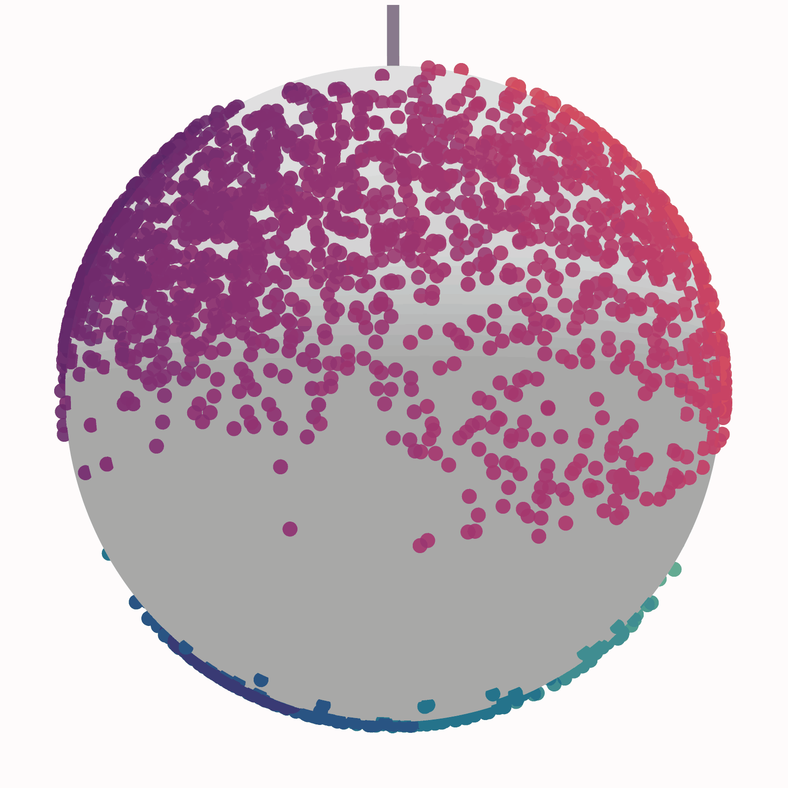

<p align="center" style="margin-bottom: 0;">
  
</p>
<h1 align="center" style="margin-top: 0;">Ouroboros</h1>

Ouroboros is designed to find cell cycle phase, cell cycle pseudotime and dormancy depth in scRNAseq datasets. It uses transfer learning within the latent space of a variational autoencoder to infer these features on new datasets. 

For more information see the Wiki: [wiki](https://steiflab.github.io/Ouroboros/)

## Installation 

Ouroboros supports Python **3.9–3.10**. Cartopy is an optional dependency required for some plotting functions. It is recommended to install via conda before installing Ouroboros. 

Installation: 
```
conda create -n ouroboros_env -c conda-forge python=3.9 pip=24.3.1
conda activate ouroboros_env 
conda install -c conda-forge cartopy 
pip install ouroboros --no-cache-dir
```

Install directly from GitHub with:
```bash 
pip install git+https://github.com/steiflab/Ouroboros.git
```

[ScPhere](https://github.com/klarman-cell-observatory/scPhere) is included as part of Ouroboros and has been updated for compatibility with TensorFlow 2. ScPhere was originally developed by Jiarui Ding and colleagues at the Klarman Cell Observatory.

Running Ouroboros within a scanpy workflow isn't strictly necessary, but if you want to work within a scanpy workflow as outlined in the tutorial, install scanpy into the environment like so:
```bash
conda activate ouroboros_env
mamba install -c conda-forge "scanpy>=1.9.3,<1.11"
```

## Running Ouroboros 
For a full tutorial see the Wiki: [wiki](https://steiflab.github.io/Ouroboros/)

There are seperate tutorials for python (scanpy) and R (seurat) users, and an additonal tutorial to embed RNA velocity vectors into the sphere. 


### To run Ouroboros on an h5ad/ Scanpy object

It's important to note that Ouroboros only works on **raw** counts, so make sure your raw counts are saved under adata.layers['raw_counts'] where Ouroboros can find them, and then save your scanpy object as an h5ad:

```python 
anndata.write_h5ad(adata.h5ad)
```

Then you can run Ouroboros on the command line like so: 
```bash 
ouroboros \
    --data /path/to/h5ad  \
    --data_type h5ad \
    --species human \
    --outdir /path/to/output/directory \
    --seed 0 \
    --repeat 5 
```

Arguments: 
| Argument      | Description                                                                   |
| ------------- | ----------------------------------------------------------------------------- |
| `--data`      | **Required.** Path to your input data file. Must be a `.h5ad` or `.csv` file. |
| `--data_type` | **Required.** Format of the input data. Must be `h5ad` or `csv`.              |
| `--species`   | Species of origin for the dataset. Must be `human` or `mouse`.  Default is human |
| `--outdir`    | Output directory where results (embeddings, figures, logs) will be saved. Default is '.'|
| `--seed`      | Seed used for Ouroborous for data reproducibility. Default is 0 |
| `--repeat`*    | Number of times to retrain model (only if input data is missing any training genes). Default is 1.|

\* If any gene is missing from training feature set from the input data, the model must be retrained. To ensure robust performance, Ouroboros will retrain the VAE {repeat} times and select the model that correlates with the consensus. However, increasing the repeat parameter will significantly extend runtime.

### Ouroboros Output

The main output from Ouroboros is `ouroboros_embedding_pseudotime.csv`, where each row represents a cell embedded in the spherical latent space. The columns are described below:

| Column                  | Description                                                                                                                                                                                    |
| ----------------------- | ---------------------------------------------------------------------------------------------------------------------------------------------------------------------------------------------- |
| `dim1`, `dim2`, `dim3`  | Three-dimensional coordinates of each cell in the spherical latent space. These coordinates are used by the `plot_sphere` and `plot_robinson_plot` functions.                                  |
| `KNN_phase`             | Cell-cycle phase assigned using K-nearest neighbors (KNN) based on the training dataset: G1, S, G2M, G1-G0 transition, or G0.                                                                  |
| `south`                 | Indicates whether a cell is located in the southern hemisphere. `True` indicates a dormant cell with a `dormancy_pseudotime`; `False` indicates a cycling cell with a `cell_cycle_pseudotime`. |
| `cell_cycle_pseudotime` | Pseudotime for cycling cells, calculated from the angular position in the northern hemisphere. Values range from 0 to 1.                                                                       |
| `dormancy_pseudotime`   | Pseudotime for dormant cells, calculated from the distance toward the southern pole. Values range from -1 to 0.                                                                                |
| `pseudotime_phase`      | Phase/state annotation based on pseudotime thresholds: G1 (0–0.4), S (0.4–0.75), G2M (0.75–1), Light dormancy (-0.4–0), Mid dormancy (-0.6–-0.4), and Deep dormancy (-1–-0.6).                 |

If the input matrix is missing one or more genes required by the training dataset, Ouroboros will retrain the model using the available training genes. Retraining may reduce model accuracy. When retraining occurs, `retrained_reference_embedding.csv` is generated, containing the three-dimensional latent-space coordinates of the retrained reference cells and their ground-truth phase labels. A `qc.csv` file is also generated containing quality-control metrics for the retrained model, including the number of missing training genes, KL divergence, log-likelihood, and SHAP score loss attributable to missing genes.

Ouroboros also generates three interactive spherical plots: `ouroboros_cell_cycle_pseudotime.html`, which displays cells coloured by cell-cycle pseudotime, `ouroboros_dormancy_pseudotime.html`, which displays cells coloured by dormancy pseudotime and `ouroboros_KNN_phase.html`, which displays cells coloured by discrete KNN_phase. The distribution of pseudotime values is additionally provided as `pseudotime_histogram.png`. 

## Plotting Ouroboros output

We have included several python functions to help you explore the Ouroboros output sphere. 

See Wiki tutorials for more information


## Acknowledgements
This project makes use of scPhere, developed by the Broad Institute and distributed under the BSD 3-Clause License.

We have included a lightly modified version of scPhere (updated for TensorFlow 2.x support) within this repository.

If you use functionality derived from scPhere, please also cite:
Ding, J., Regev, A. Deep generative model embedding of single-cell RNA-Seq profiles on hyperspheres and hyperbolic spaces. Nat Commun 12, 2554 (2021). https://doi.org/10.1038/s41467-021-22851-4

## License
Ouroboros is distributed under the MIT License (see LICENSE).
scPhere is distributed under the BSD 3-Clause License (see scphere/LICENSE).
