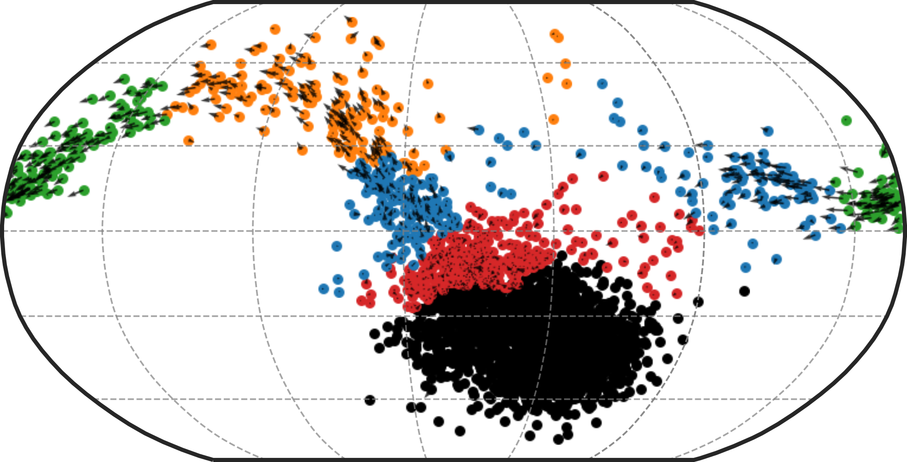

<div style="margin: 0; padding: 0;">
  
</div>


# Ouroboros

**Ouroboros** is a toolkit for investigating cell cycling and non-cycling dynamics in single-cell RNA-seq data.  

It projects cells into a spherical latent space based on a learned reference embeddings, enabling interpretable visualization of cell cycle and dormancy states. Output includes:

**ouroboros_embeddings_pseudotimes.csv:** Dataframe with cell id as index, containing discrete KNN phases, cell cycle pseudotime and dormancy depth values for each cell in your dataset. 

**ouroboros_knn_sphere.html:** 3D visualization of your dataset embedded in VAE latent space, coloured by KNN phases 

**ouroboros_cell_cycle_pseudotime.html:** 3D visualization of your dataset embedded in VAE latent space, coloured by cell cycle pseudotimes
- note that any cells that fall in the 'dormancy' range will be given a cell cycle pseudotime value of NA, and will be coloured grey 

**ouroboros_dormancy_depth.html:** 3D visualization of your dataset embedded in VAE latent space, coloured by dormancy depth
- note that any cells that fall in the 'cell cycling' range will be given a dormancy depth value of NA, and will be coloured grey 


---

## Installation 

Ouroboros supports Python 3.9–3.10. Cartopy is an optional dependency required for some plotting functions. It is recommended to install via conda before installing Ouroboros.

Installation:
```bash 
conda create -n ouroboros_env -c conda-forge python=3.9 pip=24.3.1
conda activate ouroboros_env 
conda install -c conda-forge cartopy 
pip install sc-ouroboros --no-cache-dir
```

Or install directly from GitHub with:

```bash
pip install git+https://github.com/steiflab/Ouroboros.git
```

ScPhere is included as part of Ouroboros and has been updated for compatibility with TensorFlow 2. ScPhere was originally developed by Jiarui Ding and colleagues at the Klarman Cell Observatory.

---

## Quickstart 

Ouroboros can be run on any scanpy h5ad object that has raw counts saved as adata.layers['raw_counts].

Alternatively it will also accept a csv file with genes as your column names and cell ids under the columns 'cell_id' - see our 'Ouroboros_in_R' tutorial or CLI usage for more information. 


```bash 
ouroboros \
    --data /path/to/h5ad  \
    --data_type h5ad \
    --species human \ 
    --outdir /path/to/output/directory
```

Arguments: 

| Argument      | Description                                                                   |
| ------------- | ----------------------------------------------------------------------------- |
| `--data`      | **Required.** Path to your input data file. Must be a `.h5ad` or `.csv` file. |
| `--data_type` | **Required.** Format of the input data. Must be `h5ad` or `csv`.              |
| `--species`   | Species of origin for the dataset. Must be `human` or `mouse`.  Default is human |
| `--outdir`    | Output directory where results (embeddings, figures, logs) will be saved. Default is '.'|


### A note on feature genes

A specific feature set was used to originally train Ouroboros and create the VAE latent space. If your count matrix is missing any of these genes (maybe you used a different reference or filtered them out) Ouroboros will take the features that do exist in your count matrix and **retrain** the VAE, resulting in a slightly different latent space. This could result in lower accuracy than if the full feature set is used. 

I made functions (R and Python) to test if you're missing any genes before deploying Ouroboros - see wiki tutorials [add links] for more information. 

Note also that feature genes are named by their HUGO gene names( ex. CCNE1, CCNE2), and not by their ensembl IDs (ENS...) so ensure your adata.var_names or R gene names are in this format before running Ouroboros. 


## Plotting Ouroboros output

We have included several python functions to help you explore the Ouroboros output sphere. See our tutorials and API usage for more information. 

## Performance

### Embedding cells in latent space without retraining: 
- Run time: ~1 minute 55 seconds (CPU)
- CPU utilization: ~48%
- Memory usage: ~3.16 GB RAM
- Disk I/O:
    - Read: ~4.0 GB
    - Written: ~60 MB
- Context switches:
    - Voluntary: 53,484
    - Involuntary: 123,998
- Hardware used:
    - CPU: Intel(R) Xeon(R) E7-8867 v4 @ 2.40GHz
    - RAM: 1.5 TB

### When retraining the model: 
Our training dataset includes 5698 cells and 226 genes. When training (or retraining with missing genes):

- Training time: ~2 minutes (CPU)
- Memory usage: ~821.64 MB RAM
- Hardware used: 
    - **CPU**: Intel(R) Xeon(R) E7-8867 v4 @ 2.40GHz
    - **RAM**: 1.5 TB

The model is always retrained on the same number of cells, but will likely run faster if fewer features genes are included. Note this will likely make the model less accurate. 


